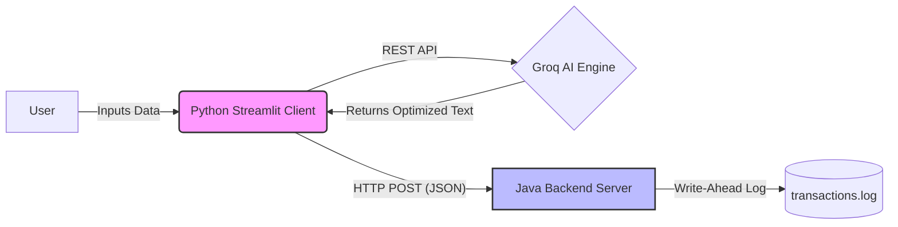

# 🚀 Resume Architect

**A Hybrid Distributed System for AI-Powered Resume Optimization.**

Resume Architect is a full-stack application that leverages Large Language Models (LLM) to tailor resumes for specific job descriptions. It demonstrates a microservices architecture by integrating a Python-based AI frontend with a high-performance Java backend for system event logging.

## 🏗 Architecture

This project implements a **Publisher-Subscriber** pattern across two distinct runtime environments.



🌟 Key Features

AI-Powered Optimization: Uses Llama 3 (via Groq API) to rewrite resumes with ATS-optimized keywords.

Hybrid Integration: Connects a Python frontend with a Java backend using a custom HTTP protocol.

Distributed Persistence: Implements a Java-based write-ahead log to audit all generation events.

System Orchestration: Automated startup script manages multi-process lifecycle (Java Daemon + Python UI).

🛠 Tech Stack

Frontend: Python, Streamlit

AI Inference: Groq Cloud API (Llama 3.3 70B)

Backend: Java (Custom HTTP Server, Socket Programming)

Protocol: HTTP/1.1, JSON

Scripting: Bash

🚀 Getting Started
Prerequisites
Python 3.x

Java JDK 8+

Groq API Key

Installation
1.Clone the repo:

```bash
git clone [https://github.com/nadavramon/resume-architect.git](https://github.com/nadavramon/resume-architect.git)
cd resume-architect
```

2.Setup Python Environment:

```bash
python -m venv venv
source venv/bin/activate
pip install -r requirements.txt
```

3.Configure API Key: Create a .env file and add:
`
GROQ_API_KEY=your_api_key_here
`

4.Run the System: Use the orchestration script to launch both backend and frontend:

```bash
chmod +x start_system.sh
./start_system.sh
```

📂 Project Structure

app.py - Streamlit frontend and AI logic.

test/ServerApp.java - Java backend source code (Pub/Sub).

server.jar - Compiled Java backend artifact.

start_system.sh - Orchestration script.

Built by Nadav Ramon.
